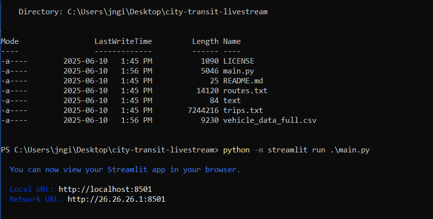
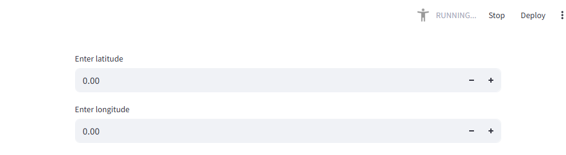
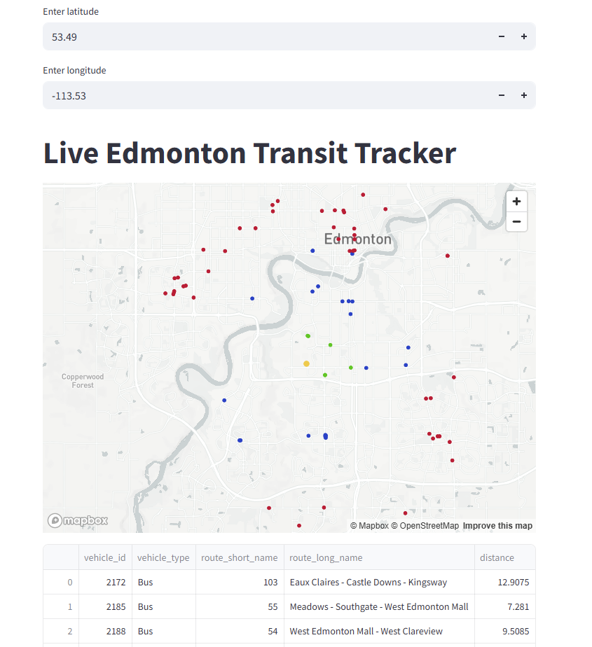
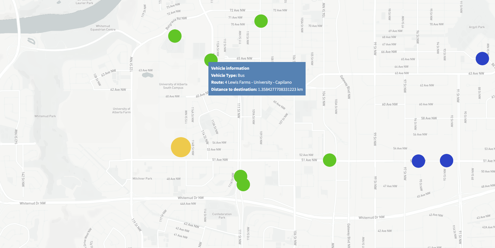
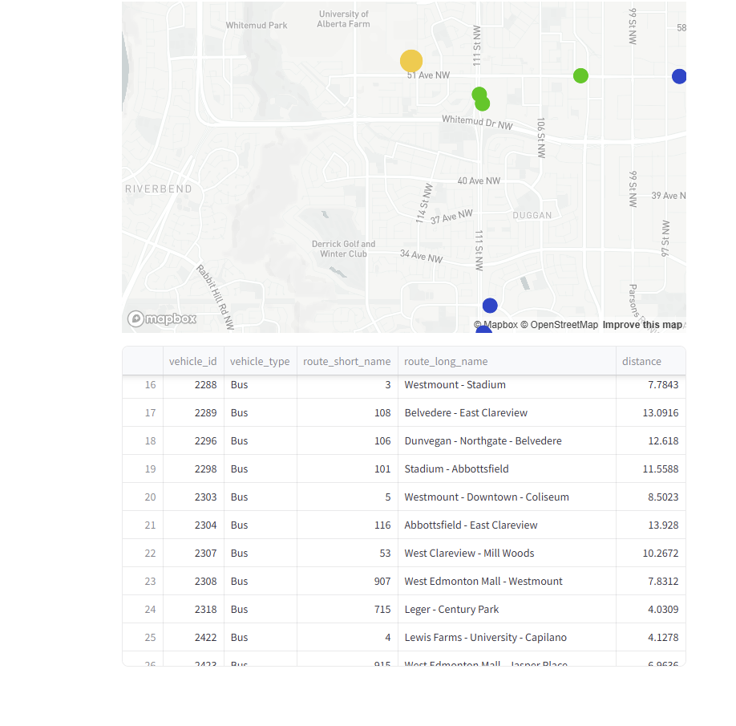

# city-transit-livestream
A python program that tracts public transit vehicles in realtime

## Usage
- Download this repository
- pip install requests gtfs-realtime-bindings protobuf pandas streamlit numpy scipy
- python -m streamlit run main.py

The user has to find (Google Maps) and enter their desired latitude and longitude

In this example I used traffic files for Edmonton AB
- Yellow dot represents the location you have chosen
- green dots represent transit vehicles with in first layer (0-interval km), where interval by default (customizable) is 3
- blue dots represent transit vehicles with in second layer (interval-2*interval km) and red ones represent (interval*2-interval*3 km)
- You can customize however you like, but of course a city's size has its limits

- 
You can zoom in on the map and hover over dots and see more information about the specific transit vehicles
- Vehicle Type (Bus, Train, Ferry, Tram...)
- Route description (Location A to location B)
- The Distance(km) to your chosen location

In case you are more of a table person and looking for some extra information, there is a table below the maplisting
all transit vehicles

## Motivation
- Tired of missing public transits, you can set distance warnings, if vehicles approach within certain
measure, you can alert yourself
- It's a cool visualization to see all the public transit vehicles within an area

## Note
- One can highly tweak the default settings of this program so serve purposes
- In this example, I used the city Edmonton AB. Theoretically as long as you could get the static transit files of a city and live fetching vehicle data (.pb), this program would work.

